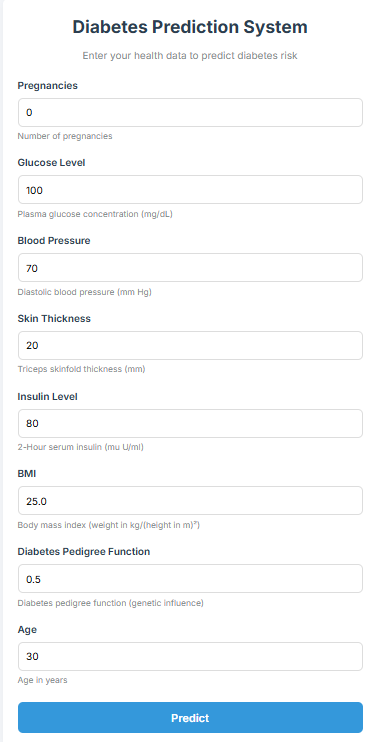
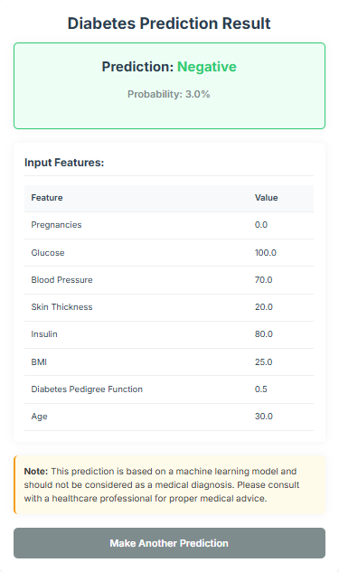

# Diabetes Prediction System

A web application that predicts diabetes risk based on health metrics using machine learning.

## Preview

### Input Form


### Results


## Features

- Interactive form for entering health metrics
- Real-time diabetes risk prediction with probability score
- Responsive design for all devices

## Technology

- Frontend: HTML, CSS, JavaScript
- Machine Learning: JavaScript implementation of Random Forest classifier

## Deployment

### Netlify

1. Push code to GitHub
2. Connect repository to Netlify
3. Set publish directory to `public`

### Local Development

Open `public/index.html` in your browser

## Project Structure

```
├── public/                # Static site files
│   ├── index.html         # Main application
│   └── static/            # CSS and assets
└── netlify.toml          # Netlify configuration
```

## Author

- **Rythmokay**