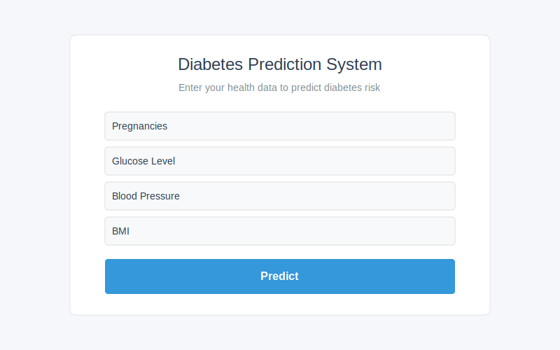

# 🩺 Diabetes Prediction System

<p align="center">
  
</p>

A modern web application that predicts diabetes risk based on health metrics using machine learning. The application uses a model based on the Pima Indians Diabetes Dataset to provide risk assessments with probability scores. This version is optimized for static hosting on Netlify.

## ✨ Features

- 📊 Interactive web interface for entering health metrics
- 🔮 Real-time prediction of diabetes risk with probability percentage
- 📱 Responsive design that works on mobile, tablet, and desktop devices
- 📋 Detailed results page with input feature summary
- 🌐 Static site deployment on Netlify with client-side prediction

## 📷 Screenshots

### Input Form
<p align="center">
  
  <br>
  <em>Users enter their health metrics through an intuitive form interface</em>
</p>

### Results Page
<p align="center">
  
  <br>
  <em>Prediction results with probability score and input feature summary</em>
</p>

## 🛠️ Technology Stack

- **Frontend**: HTML5, CSS3 with responsive design
- **Prediction**: JavaScript implementation of decision tree ensemble
- **Deployment**: Netlify static site hosting

## 📊 Dataset

The application is based on the Pima Indians Diabetes Dataset, which includes the following features:

- Pregnancies: Number of times pregnant
- Glucose: Plasma glucose concentration (mg/dL)
- BloodPressure: Diastolic blood pressure (mm Hg)
- SkinThickness: Triceps skinfold thickness (mm)
- Insulin: 2-Hour serum insulin (mu U/ml)
- BMI: Body mass index (weight in kg/(height in m)²)
- DiabetesPedigreeFunction: Diabetes pedigree function (genetic influence)
- Age: Age in years
- Outcome: Class variable (0: No diabetes, 1: Diabetes)

## 🌐 Deployment

### Netlify Deployment

This application is optimized for deployment on Netlify as a static site:

1. Fork or clone the repository:
   ```bash
   git clone https://github.com/Rythmokay/Diabetes-prediction-.git
   cd Diabetes-prediction-
   ```

2. Deploy to Netlify:
   - Connect your GitHub repository to Netlify
   - Use the default Netlify settings (it will automatically detect the static site)
   - No build command is required as this is a pure static site

### Local Development

To run the application locally:

1. Open the `public/index.html` file in your web browser

## 📁 Project Structure

```
├── public/                # Static site files
│   ├── index.html         # Main application page
│   └── static/            # Static assets
│       └── styles.css     # CSS styles
├── screenshots/           # Application screenshots
│   ├── input_screen.svg   # Input form screenshot
│   └── output_screen.svg  # Results page screenshot
├── netlify.toml          # Netlify configuration
├── .gitignore            # Git ignore rules
└── README.md             # Project documentation
```

## ⚙️ How It Works

The application uses a client-side implementation of a decision tree ensemble to predict diabetes risk:

1. **Data Collection**: Users enter their health metrics through a web form
2. **Data Processing**: JavaScript code normalizes the input features using pre-calculated means and standard deviations
3. **Prediction**: A JavaScript implementation of a decision tree ensemble (similar to Random Forest) makes predictions
4. **Results Display**: The prediction result is displayed with probability score and input feature summary

This static implementation allows the application to run entirely in the browser without any server-side processing, making it perfect for deployment on static hosting platforms like Netlify.

## 🔍 Model Performance

The JavaScript implementation of the decision tree ensemble approximates the behavior of the original Random Forest classifier. While the exact performance metrics may differ slightly from the original Python model, it provides a reasonable approximation for demonstration purposes in a static site environment.

The client-side model uses:

- Feature normalization based on the Pima Indians dataset statistics
- An ensemble of decision trees with different feature focuses
- Probability calculation through ensemble averaging

## 📝 Future Improvements

- Implement more advanced client-side machine learning with TensorFlow.js
- Add visualization charts for prediction results
- Create a user account system to save prediction history
- Add explanations for feature importance in predictions
- Implement offline capabilities with Progressive Web App features

## 👨‍💻 Author

- **Rythmokay** - *Initial work*

## 👍 Acknowledgments

- UCI Machine Learning Repository for the Pima Indians Diabetes Dataset
- Netlify for static site hosting
- The open-source web development community

## 🔒 Privacy

This application does not store any user data. All predictions are made in real-time and are not saved or transmitted to any external servers.

## 📄 License

This project is licensed under the MIT License - see the LICENSE file for details.

## 👥 Contributing

Contributions are welcome! Please feel free to submit a Pull Request.

## 📞 Contact

If you have any questions or suggestions, please open an issue or contact the repository owner.

---

<p align="center">
Made with ❤️ for better healthcare through technology
</p>