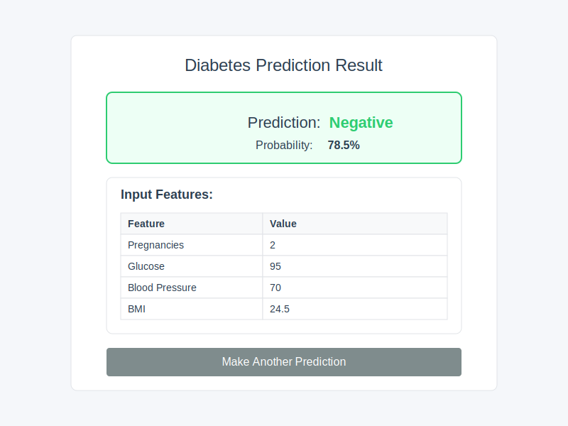

# 🩺 Diabetes Prediction System

<p align="center">
  
</p>

A modern web application that predicts diabetes risk based on health metrics using machine learning. The application uses a Random Forest model trained on the Pima Indians Diabetes Dataset to provide risk assessments with probability scores. This version uses a Python API for predictions and a static frontend hosted on Netlify.

## ✨ Features

- 📊 Interactive web interface for entering health metrics
- 🔮 Real-time prediction of diabetes risk with probability percentage
- 📱 Responsive design that works on mobile, tablet, and desktop devices
- 📋 Detailed results page with input feature summary
- 🌐 Static frontend on Netlify with Python API for accurate predictions
- 🧠 Uses the original Random Forest model for maximum accuracy

## 📷 Screenshots

### Input Form
<p align="center">
  
  <br>
  <em>Users enter their health metrics through an intuitive form interface</em>
</p>

### Results Page
<p align="center">
  
  <br>
  <em>Prediction results with probability score and input feature summary</em>
</p>

## 🛠️ Technology Stack

- **Frontend**: HTML5, CSS3 with responsive design
- **Backend**: Python Flask API with scikit-learn
- **Machine Learning**: Random Forest classifier trained on the Pima Indians dataset
- **Deployment**: 
  - Frontend: Netlify static site hosting
  - Backend: Python API on platforms like Render, Heroku, or PythonAnywhere

## 📊 Dataset

The application is based on the Pima Indians Diabetes Dataset, which includes the following features:

- Pregnancies: Number of times pregnant
- Glucose: Plasma glucose concentration (mg/dL)
- BloodPressure: Diastolic blood pressure (mm Hg)
- SkinThickness: Triceps skinfold thickness (mm)
- Insulin: 2-Hour serum insulin (mu U/ml)
- BMI: Body mass index (weight in kg/(height in m)²)
- DiabetesPedigreeFunction: Diabetes pedigree function (genetic influence)
- Age: Age in years
- Outcome: Class variable (0: No diabetes, 1: Diabetes)

## 🌐 Deployment

This application consists of two parts that need to be deployed separately:
1. A static frontend (HTML/CSS/JS) hosted on Netlify
2. A Python API that runs the actual machine learning model

### Python API Deployment

1. Deploy the Python API first:

   ```bash
   # Clone the repository
   git clone https://github.com/Rythmokay/Diabetes-prediction-.git
   cd Diabetes-prediction-
   
   # Deploy the API to a Python-friendly platform
   # Option 1: Render.com
   # - Create a new Web Service on Render
   # - Connect your GitHub repository
   # - Set the build command: pip install -r api/requirements.txt
   # - Set the start command: gunicorn --chdir api app:app
   
   # Option 2: Heroku
   # - Create a new Heroku app
   # - Set the buildpack to Python
   # - Deploy the api directory
   # - Set the Procfile to: web: gunicorn --chdir api app:app
   
   # Option 3: PythonAnywhere
   # - Upload the api directory
   # - Set up a web app with Flask
   # - Configure the WSGI file to point to api/app.py
   ```

2. After deploying the API, note the URL where it's hosted (e.g., `https://your-app-name.onrender.com`)

3. Update the API_URL in `public/index.html` to point to your deployed API:
   ```javascript
   const API_URL = 'https://your-app-name.onrender.com/api/predict';
   ```

### Frontend Deployment on Netlify

1. After updating the API URL, deploy the frontend to Netlify:

   ```bash
   # Deploy to Netlify
   # Option 1: Netlify CLI
   netlify deploy --dir=public --prod
   
   # Option 2: Netlify UI
   # - Connect your GitHub repository to Netlify
   # - Set the publish directory to 'public'
   # - No build command is required
   ```

### Local Development

To run the application locally:

1. Start the Python API:
   ```bash
   cd api
   pip install -r requirements.txt
   python app.py
   ```

2. Update the API_URL in `public/index.html` to point to your local API:
   ```javascript
   const API_URL = 'http://localhost:5000/api/predict';
   ```

3. Open the `public/index.html` file in your web browser

## 💡 Project Structure

```
├── api/                  # Python API for predictions
│   ├── app.py             # Flask API application
│   └── requirements.txt   # Python dependencies
├── data/                 # Dataset directory
│   └── diabetes.csv       # Pima Indians Diabetes Dataset
├── public/                # Static frontend files
│   ├── index.html         # Main application page
│   └── static/            # Static assets
│       └── styles.css     # CSS styles
├── screenshots/           # Application screenshots
│   ├── input_screen.svg   # Input form screenshot
│   └── output_screen.svg  # Results page screenshot
├── netlify.toml          # Netlify configuration
├── app.py                # Original Flask application
├── .gitignore            # Git ignore rules
└── README.md             # Project documentation
```

## ⚙️ How It Works

The application uses a client-server architecture to predict diabetes risk:

1. **Data Collection**: Users enter their health metrics through a web form
2. **API Request**: The frontend sends the health metrics to the Python API
3. **Data Processing**: The Python API normalizes the input features using StandardScaler
4. **Prediction**: The actual Random Forest model trained on the Pima Indians dataset makes predictions
5. **API Response**: The prediction results are sent back to the frontend
6. **Results Display**: The prediction result is displayed with probability score and input feature summary

This architecture combines the benefits of static site hosting (fast loading, global CDN) with the accuracy of the original Python machine learning model.

## 🔍 Model Performance

This application uses the original Python Random Forest classifier trained on the Pima Indians Diabetes Dataset, ensuring maximum prediction accuracy. The model achieves good performance metrics on the test dataset.

The Python model includes:

- Feature normalization using scikit-learn's StandardScaler
- Random Forest classifier with 100 estimators
- Probability calculation based on the full ensemble of decision trees
- Cross-validation to ensure model robustness

## 📝 Future Improvements

- Implement more advanced client-side machine learning with TensorFlow.js
- Add visualization charts for prediction results
- Create a user account system to save prediction history
- Add explanations for feature importance in predictions
- Implement offline capabilities with Progressive Web App features

## 👨‍💻 Author

- **Rythmokay** - *Initial work*

## 👍 Acknowledgments

- UCI Machine Learning Repository for the Pima Indians Diabetes Dataset
- Netlify for static site hosting
- The open-source web development community

## 🔒 Privacy

This application does not store any user data. All predictions are made in real-time and are not saved or transmitted to any external servers.

## 📄 License

This project is licensed under the MIT License - see the LICENSE file for details.

## 👥 Contributing

Contributions are welcome! Please feel free to submit a Pull Request.

## 📞 Contact

If you have any questions or suggestions, please open an issue or contact the repository owner.

---

<p align="center">
Made with ❤️ for better healthcare through technology
</p>